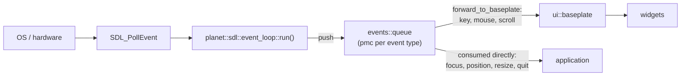

# events

* [`planet/events/action.hpp`](./action.hpp) -- The `action` enumeration describing the state transitions of a mouse or keyboard key (`released`, `down`, `held`, `up`).
* [`planet/events/back.hpp`](./back.hpp) -- The `back` message, sent when the user wants to go back.
* [`planet/events/focus.hpp`](./focus.hpp) -- The `window_focus` enumeration (`lost`, `gained`) and the `focus` event describing a change to the window's focus.
* [`planet/events/keys.hpp`](./keys.hpp) -- The `scancode` enumeration of locale independent keyboard scan codes (following the USB HID specification), together with the `key` press/release event.
* [`planet/events/mouse.hpp`](./mouse.hpp) -- The low-level `mouse` event and `button` enumeration, the higher level `click` event, and `identify_clicks` which turns a stream of mouse data into a stream of clicks.
* [`planet/events/position.hpp`](./position.hpp) -- The `position` event describing a change to the window's on-screen position.
* [`planet/events/queue.hpp`](./queue.hpp) -- The events bus. A `queue` holds the raw event queues that the platform layer feeds and the game consumes.
* [`planet/events/quit.hpp`](./quit.hpp) -- The `quit` message, sent when the user wants to quit.
* [`planet/events/resize.hpp`](./resize.hpp) -- The `window_resize` enumeration (`minimise`, `maximise`, `full_screen`, `change`) and the `resize` event describing a change to the window's size.
* [`planet/events/scroll.hpp`](./scroll.hpp) -- The `scroll` wheel event.

## Handling events

This library only defines the event *vocabulary* -- the small data structures for each kind of event and the `events::queue` bus that carries them. It knows nothing about the operating system, windowing or hardware, so on its own it never produces an event; something has to translate real input into these types and push it onto a queue.

That translation is the job of a platform layer, and the one we use is the [**planet-sdl**](https://blue5alamander.com/open-source/planet-sdl/) library. Its `planet::sdl::event_loop` (see [`planet/sdl/event-loop.hpp`](https://blue5alamander.com/open-source/planet-sdl/include/planet/sdl/event-loop.hpp)) owns an `events::queue` and runs a coroutine, `run()`, which repeatedly calls `SDL_PollEvent`, maps each `SDL_Event` onto the matching planet type (an `SDL_EVENT_KEY_DOWN` becomes an `events::key`, mouse buttons and motion become `events::mouse`, the wheel becomes `events::scroll`, and window close becomes `events::quit`), and `push`es it onto the appropriate queue. Mouse positions are scaled by the window's pixel density as they are read so that consumers always work in drawable pixels.

Each member of the `queue` is a `planet::queue::pmc` (push-producer, multi-consumer): every subscriber is guaranteed to see every value that is pushed, so several parts of the application can watch the same event stream independently.

The events then flow towards the UI. `event_loop::forward_to_baseplate` subscribes to the event loop's queues and forwards them into a `ui::baseplate`'s own `events::queue`, from which the widgets draw the input they respond to.

The practical consequence is that a program which wants to react to real input has to depend on planet-sdl (or provide an equivalent platform layer of its own). Depending on `planet::events` alone gives you the types and the bus but nothing to fill it.

### Event routing

Once the events are on the bus they do not all travel to the same place: the interactive events are forwarded to the `ui::baseplate` for the widgets, while the window events are consumed directly from the event loop. See [`planet/sdl/event-loop.hpp`](https://blue5alamander.com/open-source/planet-sdl/include/planet/sdl/event-loop.hpp) for further details.
