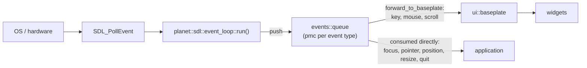

# events

* [`planet/events/action.hpp`](./action.hpp) -- The `action` enumeration describing the state transitions of a mouse or keyboard key (`released`, `down`, `held`, `up`).
* [`planet/events/back.hpp`](./back.hpp) -- The `back` message, sent when the user wants to go back.
* [`planet/events/focus.hpp`](./focus.hpp) -- The `window_focus` enumeration (`lost`, `gained`) describing a change to the window's keyboard focus.
* [`planet/events/key_binding.hpp`](./key_binding.hpp) -- The `key_binding`, a `scancode` and the `modifiers` that must be held with it. This is the part of a `key` event that says which combination was pressed, without the `action` and `timestamp` that belong to one particular press, so it is what a configurable control is stored as. Serialisation for it is in [`planet/serialise/events.hpp`](../serialise/events.hpp).
* [`planet/events/keys.hpp`](./keys.hpp) -- The `scancode` enumeration of locale independent keyboard scan codes (following the USB HID specification), together with the `key` press/release event and the `modifiers` (shift, ctrl, alt, gui) it carries.
* [`planet/events/mouse.hpp`](./mouse.hpp) -- The low-level `mouse` event and `button` enumeration, the `window_pointer` enumeration (`enter`, `leave`) describing the pointer crossing the window boundary, the higher level `click` event, and `identify_clicks` which turns a stream of mouse data into a stream of clicks.
* [`planet/events/queue.hpp`](./queue.hpp) -- The events bus. A `queue` holds the raw event queues that the platform layer feeds and the game consumes. The window's on-screen position has no event type of its own -- it is carried straight through as an `affine::point2d`.
* [`planet/events/quit.hpp`](./quit.hpp) -- The `quit` message, sent when the user wants to quit.
* [`planet/events/resize.hpp`](./resize.hpp) -- The `window_resize` enumeration (`minimise`, `maximise`, `full_screen`, `change`) and the `resize` event describing a change to the window's size.
* [`planet/events/scroll.hpp`](./scroll.hpp) -- The `scroll` wheel event, which carries the `modifiers` held while the wheel turned.
* [`planet/events/text.hpp`](./text.hpp) -- The `text` event carrying the UTF-8 characters the user has typed, as opposed to the physical keys `keys.hpp` reports.

## Handling events

This library only defines the event *vocabulary* -- the small data structures for each kind of event and the `events::queue` bus that carries them. It knows nothing about the operating system, windowing or hardware, so on its own it never produces an event; something has to translate real input into these types and push it onto a queue.

That translation is the job of a platform layer, and the one we use is the [**planet-sdl**](https://blue5alamander.com/open-source/planet-sdl/) library. Its `planet::sdl::event_loop` (see [`planet/sdl/event-loop.hpp`](https://blue5alamander.com/open-source/planet-sdl/include/planet/sdl/event-loop.hpp)) owns an `events::queue` and runs a coroutine, `run()`, which repeatedly calls `SDL_PollEvent`, maps each `SDL_Event` onto the matching planet type (an `SDL_EVENT_KEY_DOWN` becomes an `events::key`, mouse buttons and motion become `events::mouse`, the wheel becomes `events::scroll`, the pointer crossing the window boundary becomes an `events::window_pointer`, and window close becomes `events::quit`), and `push`es it onto the appropriate queue. Mouse positions are scaled by the window's pixel density as they are read so that consumers always work in drawable pixels.

Each member of the `queue` is a `planet::queue::pmc` (push-producer, multi-consumer): every subscriber is guaranteed to see every value that is pushed, so several parts of the application can watch the same event stream independently.

The events then flow towards the UI. `event_loop::forward_to_baseplate` subscribes to the event loop's queues and forwards them into a `ui::baseplate`'s own `events::queue`, from which the widgets draw the input they respond to.

The practical consequence is that a program which wants to react to real input has to depend on planet-sdl (or provide an equivalent platform layer of its own). Depending on `planet::events` alone gives you the types and the bus but nothing to fill it.

### Event routing

Once the events are on the bus they do not all travel to the same place: the interactive events are forwarded to the `ui::baseplate` for the widgets, while the window events are consumed directly from the event loop. See [`planet/sdl/event-loop.hpp`](https://blue5alamander.com/open-source/planet-sdl/include/planet/sdl/event-loop.hpp) for further details.

That split is also why only the routable events carry a `timestamp`. A `key`, `mouse` or `scroll` event is queued, forwarded and finally consumed by a widget some way from the input, and when it happened is part of what it means -- double click intervals and repeat rates are read off it. The window events are drained immediately by application glue that only records the new state, so "when" adds nothing to "now" and they carry their payload alone. Where that payload is a single value there is no struct at all: `focus` and `pointer` are bare enumerations and `position` is a bare `affine::point2d`.

### Keyboard focus and the pointer are independent

`window_focus` and `window_pointer` describe two different things and are reported separately rather than as one enumeration, because all four combinations occur: the pointer can leave a window that keeps keyboard focus (the usual case for click to focus), and a window can lose focus with the pointer still sitting inside it. Neither can be derived from the other -- a window manager that ties them together is following its own policy, not something the events guarantee.

A `window_pointer::leave` means the pointer is gone, not that it has moved somewhere else, so there is no coordinate to report. A UI that tracks hovering needs to consume this: with nothing to say otherwise the last location the pointer was seen at stands, and whatever widget sits under it goes on counting as hovered for as long as the pointer is away. `window_pointer::enter` usually needs no handling of its own, as a motion event follows the pointer back into the window.
